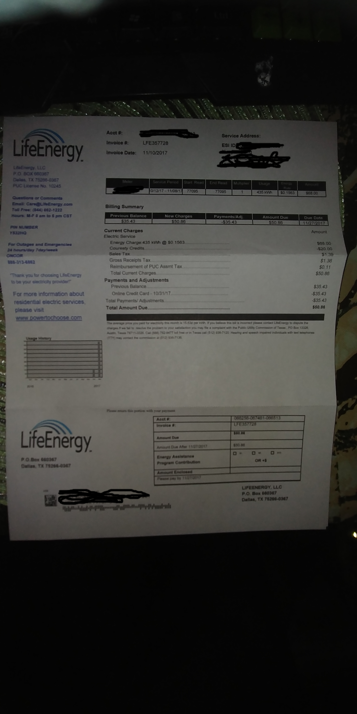

Acct #:

LifeEnergy.

Service Address:

Invoice #:

LFE357728

ESI ID

Invoice Date:

11/10/2017

LdoEnergy. LLC

PO BOX 660307

Dallas, TX 75268-0387

PUC License No. 10245

tart Read

Usage

0/12/17 - 11/08/17

77095

77095

435 kWh

Questions or Comm

$0. 1583

$68 00

nments

it: Care@

Toll Free:(

Energy.com

: (844) 662-1222

Billing Summary

Hours: M-F 8 am to S pm CST

Previous Balance

New Charges

$35.43

$50.86

Payments/Adj.

Amount Due

Due Date

$50.86

PIN NUMBER

11/27/2017

Y832HQ

Current Charges

Electric Service

Amount

For Outages and Emergencies

Energy Charge:435 kWh @ $0 1563

24 hours/day 7day week

Couresty Credits

$68.00

ONCOR

Sales Tax

$20 00

$1

80a-313-6862

Gross Receipts Tax

Reimbursement of PUC Assmt Tax

$1 36

SO. 11

"Thank you for choosing LifeEnergy

Total Current Charges

$50.

to be your eiectricity provider?

Payments and Adjustments

Previous Balance...

$35.43

For more information about

Online Credit Card - 10/31/17

$35 43

residential electric services

Total Payments/ Adjustments.

$35.43

please visit

Total Amount Due.

$50

www.powertochoose.com

ay to dispute the

on of Texas . PO Box 13328

9-6477 tol

call ($12) 936

telephon

Acct #

0684:38 08/481-068513

LifeEnergy.

writba Ater 1190?2017

gy Assistance

P O Bon 640347

vegas Combs

OR . !

Outtas, TX 79394 0647

LIPEENERGY, LLC

P.O. Box 600387

Dallas, TX 78269-0367

