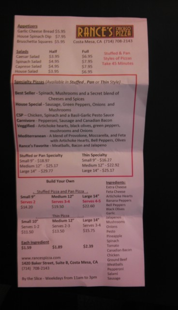

Acct #:

LifeEnergy.

Service Address:

Invoice #:

LFE357728

ESI ID

Invoice Date:

11/10/2017

LdoEnergy. LLC

PO BOX 660307

Dallas, TX 75268-0387

PUC License No. 10245

tart Read

Usage

0/12/17 - 11/08/17

77095

77095

435 kWh

Questions or Comm

$0. 1583

$68 00

nments

it: Care@

Toll Free:(

Energy.com

: (844) 662-1222

Billing Summary

Hours: M-F 8 am to S pm CST

Previous Balance

New Charges

$35.43

$50.86

Payments/Adj.

Amount Due

Due Date

$50.86

PIN NUMBER

11/27/2017

Y832HQ

Current Charges

Electric Service

Amount

For Outages and Emergencies

Energy Charge:435 kWh @ $0 1563

24 hours/day 7day week

Couresty Credits

$68.00

ONCOR

Sales Tax

$20 00

$1

80a-313-6862

Gross Receipts Tax

Reimbursement of PUC Assmt Tax

$1 36

SO. 11

"Thank you for choosing LifeEnergy

Total Current Charges

$50.

to be your eiectricity provider?

Payments and Adjustments

Previous Balance...

$35.43

For more information about

Online Credit Card - 10/31/17

$35 43

residential electric services

Total Payments/ Adjustments.

$35.43

please visit

Total Amount Due.

$50

www.powertochoose.com

ay to dispute the

on of Texas . PO Box 13328

9-6477 tol

call ($12) 936

telephon

Acct #

0684:38 08/481-068513

LifeEnergy.

writba Ater 1190?2017

gy Assistance

P O Bon 640347

vegas Combs

OR . !

Outtas, TX 79394 0647

LIPEENERGY, LLC

P.O. Box 600387

Dallas, TX 78269-0367

TEL: 626.614.8188

FAX: 626.614.8688

Hong Yel Restaurant

288 S. San Gabriel Blvd., #103-104

San Gabriel, CA 91776

www.hongyeirestau

Appetizers

Garlic Cheese Bread $5.95

House Spinach Dip $7.95

RANCE'S PIZZA

Bruschetta Squares $5.95

Costa Mesa, CA (714) 708-2143

Salech

Half

Fall

Caesar Salad

53.95

$6.95

Stuffed & Pan

Spinach Salad

$4.95

$7.95

Styles of Pizzas

Caprese Salad

$4.95

57.95

Take 45 Minutes

House Salad

53.95

$6.95

Specialty Pizzas (Available in Stuffed . Pan or Thin Style)

Best Seller - Spinach, Mushrooms and a Secret blend of

Cheeses and Spices

House Special - Sausage, Green Peppers, Onions and

Mushrooms

CSP - Chicken, Spinach and a Basil-Garlic Pesto Sauce

Carnivore - Pepperoni, Sausage and Canadian Bacon

Veggified - Artichoke hearts, black olives, green peppers,

mushrooms and Onions

Mediterranean - A blend of Provolone, Mozzarella, and Feta

with Artichoke Hearts, Bell Peppers, Olives

Rance's Favorite - Meatballs, Bacon and Jalapeno

Stuffed or Pan Specialty

Thin Specialty

Small 9" - 518.97

Small 9" - $16.27

Medium 12" - $25.17

Medium 12" - $22.92

Large 14" - $29.77

Large 14" - $25.17

Build Your Own

Ingredientst

Stuffed Pizza and Pan Pizza.

Extra Cheese

Large 14"

Feta Cheese

Small 9"

Medium 12"

Artichoke Hearts

Serves 2

Serves 3-4

Serves 4-5

Banana Peppers

$34.20

519.50

$22.60

Bell Peppers

Black Olives

Thin Pizza

Garlic

Small 10"

Medium 12"

Large 14"

Jalapenos

Mushroom

Serves 1-2

Serves 2-3

Serves 3-4

Onians

512.50

513.50

$15.75

Pesto

Pineapple

Each Ingredient

Spinach

$1.59

$1.89

$2.39

Tomato

Canadian Bacon

www.rancespizza.com

Chicken

1420 Baker Street, Suite B. Costa Mesa, CA

Ground Beet

(714) 708-2143

Meatballs

Pepperon

By the Slice - Weekdays from 11am to 3pm

Salami

Sausage

How to clean

WHOLE FOODS MARKET

JAMBOREE

daily specials

MONDAY:

MEATLESS MONDAYS

Enjoy a veggie entree, sandwich or pizza for a

OFF

special discounted price. (Specially marked items only)

REGULAR

PRICES VARY

TUESDAY:

$1 STREET TACOS

Choose from beef, chicken and carnitas topped

with cilantro and onion.

ONLY $TEA

649 HOT & COLD

WEDNESDAY: "GL FOOD BARS

Breakfast, Lunch & Dinner in our Prepared Foods $ OFF

Department.

REGULAR PRICE

THURSDAY:

5 FOR $5

HEALTH STARTS HERE

PLATES

1 scoop of 5 different Health Starts Here?

HEALTHY

items in the cold case for only $5.

SAVINGS!

FRIDAY:

IT'S A WRAP!

Choose from : Albacore Tuna, BLT, Chicken Caesar, Chicken Salad, Roast Beef &

$2 OFF ASSORTED WRAPS

Cheddar, Quinoa, Sesame Tofu, Smoked Turkey Gouda, Turkey Bacon, & Turkey Swiss. SAVES ) OFF

ASSORTED

(Specially marked items only)

SATURDAY:

SOUP & A SANDWICH

SATURDAYS

$1. SAVE $799

BUY A SMALL

SOUP &

SANDWICH

IND

BUY ONE GET ONE FREE

Visit our prepack pizza section and choose from cheese,

TAKE

BAKE P

ZAS

peppe

and vegi

vailable i

12" and

LECT PREPA

ZAS. OF EQUAL

SER VALUE

POGC

Nutrition Facts

Serving Size 2 tsp (5g)

Servings Per Container about 9

CROCK.POT.

. THE ORIGINAL SLOW COOKER -

Amount Per Sesving

Calories 15

Calories from Fat 0

Hearty Beef Stew

% Daily Value

Total Fat 0g

0%

What You'll Need

Saturated Fat 0g

0%

. 1 pkg. Crock-Pot Hearty Beef . 5 cups cut-up fresh

Trans Fat 0g

Stew Seasoning

vegetables, such as carrots,

Cholesterol Omg

0%

. 2 lbs. beef for stewing, cut

onions, celery, and potatoes

Sodium 550mg

23%

into 1 inch cubes

. 1 1/3 cup (315mL) water

Total Carbohydrate 39

1%

Dietary Fiber 0g

Preparation

Sugars 0g

Protein 0g

1 PLACE meat and vegetables in

Vitamin A 0%

Vitamin C 0%

BEST BY 12 NOV 2014 L9 557167-2 22.26

CROCK POT

slow cooker.

Calcium 0%

Iron 0%

"Percent Daily Values are based on a 2,000 calorie

diet, Your daily values may be higher or lower

depending on your calorie needs.

2 MIX entire seasoning packet

Calories

Total Fa

2,000

2,500

Saturatediet

Less than

659

with 1 1/3 cup water until

blended. Pour over beef and

209

25g

Cholersten

Less than

300mg

Sodium

300mg

Less than

2,400mg

vegetables. Stir well.

Total Catoygrate

2,400mg

300g

Dietary Pte

3759

250

309

Calories per pam:

3 COVER & COOK 8 hours on

Fat 9 . Carbohydrate 4 . Protein 4

low or 4 hours on high.

INGREDIENTS: MODIFIED CORN STARCH, HYDROLYZED CORN

PROTEIN AU WHEAT GLUTEN, SALT, MALTODEXTRIN, SUGAR,

DO NOT REMOVE COVER

GARLIC FINDER, SPICES, CARAMEL COLOR (SULFITES).

DURING COOKING

HYDROLYE YEAST PROTEIN, ONION POWDER, PAPRIKA,

RENDERED BEEF FAT, BEEF STOCK, VINEGAR SOLIDS,

More great recipes using Crock-Pot Seasonings at crockpotseasoningscom

DEHYDRATED PARSLEY, NATURAL FLAVORS, RED WINE

2011 Sunbeam Products, Inc. d/b/a Jarden

VINEGAR SUICON DIOXIDE

Consumer Solutions. All rights reserved.

CONTAINS WHEAT

Crock-Pot" logo is a registered trademark of

Sunbeam Products, Inc. used under license.

DISTRIBUTED BY B&G FOODS, INC.

Your satisfaction is important to us.

PARSIPPANY, NJ 07054 USA

Send comments or questions to us at

2011B&G FOODS, INC.

www.bgfoods.com or Consumer Affairs

PO Box K, Roseland, NJ 07068

0

47800 51402 3